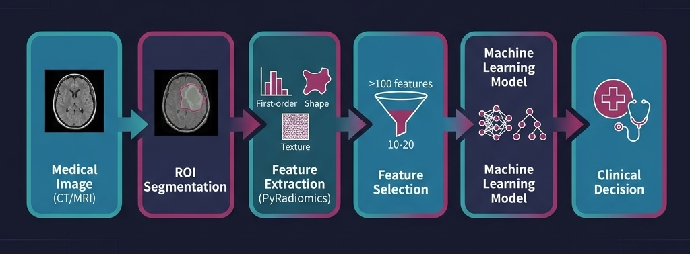

<!-- 
This presentation can be used with:
- Marp (VS Code extension): https://marketplace.visualstudio.com/items?itemName=marp-team.marp-vscode
- Convert to PowerPoint: marp --pptx SLIDES.md
- Convert to PDF: marp --pdf SLIDES.md
-->

<style>
section {
  font-family: 'Segoe UI', sans-serif;
  font-size: 24px;
  padding: 40px;
  padding-left: 80px;
}
h1 {
  color: #2E86AB;
  font-size: 32px;
  margin-top: 0;
}
h2 {
  color: #A23B72;
  font-size: 28px;
  margin-top: 0;
}
h3 {
  color: #444;
  font-size: 24px;
  margin-top: 0;
}
.highlight {
  color: #F18F01;
  font-weight: bold;
}
.code {
  font-family: 'Consolas', monospace;
  background: #f4f4f4;
  padding: 10px 10px;
  border-radius: 10px;
}
blockquote {
  border-left: 4px solid #2E86AB;
  padding-left: 16px;
  color: #555;
  font-style: italic;
}
table {
  font-size: 20px;
}
</style>

<!-- _class: lead -->

# Radiomics for Medical Image Classification
## A Hands-on Student Project

**Department of Radiological Technology**
*Machine Learning in Medical Imaging*

<!-- Speaker notes:
- Welcome students, introduce the project scope
- This is a hands-on project: you'll write code and interpret results
- Estimated time: 2-3 sessions (Feature Extraction + ML + Report)
-->

---

# Outline

1. 🔬 What is Radiomics & Why It Matters
2. 📊 Types of Radiomic Features
3. ⚙️ The Advanced Pipeline
4. 💾 Available Datasets
5. 🚀 Getting Started & Notebooks
6. 📈 Machine Learning Workflow
7. 🏆 Best Practices & Common Pitfalls
8. 📝 Assignment Guidelines

---

# The Clinical Motivation

Two head-and-neck tumors may **look identical** on a CT scan.

But radiomics reveals one has **higher entropy** and **irregular texture**, predicting aggressive behavior.

> In a study of 300 HNSCC patients, radiomic features predicted HPV status with **AUC > 0.80** — without biopsy.
> — *Vallières et al., Scientific Reports, 2017*

✅ **Non-invasive** | ✅ **Quantitative** | ✅ **Reproducible**

---

# What is Radiomics?

 Definition: **Radiomics** = Extracting **quantitative features** from medical images to:
- Predict disease outcomes
- Classify tumor types
- Personalize treatment

### The Pipeline



---

# Radiomics Over Traditional Imaging

| Aspect | Traditional Imaging | Radiomics Approach |
|--------|--------------------|--------------------|
| Assessment | Qualitative | ✅ Quantitative |
| Interpretation | Subjective | ✅ Objective |
| Reproducibility | Low | ✅ IBSI-standardized |
| Prediction | Limited | ✅ Predictive |
| Invasiveness | May need biopsy | ✅ Non-invasive |

**IBSI** = Image Biomarker Standardisation Initiative.

---

# Types of Radiomic Features

### 1. First-Order Statistics (19 features)
- Mean, median, variance, skewness, kurtosis
- Energy, entropy
- **What they capture**: Intensity distribution

### 2. Shape Features (14–16 features)
- Volume, surface area, sphericity, compactness
- Elongation, flatness
- **What they capture**: Tumor geometry

---

# Texture Features (~70 features)

| Matrix | Full Name | What It Measures |
|--------|-----------|-----------------|
| **GLCM** | Gray Level Co-occurrence | Spatial relationships |
| **GLRLM** | Gray Level Run Length | Consecutive same-intensity |
| **GLSZM** | Gray Level Size Zone | Connected regions |
| **GLDM** | Gray Level Dependence | Voxel neighborhood |
| **NGTDM** | Neighboring Gray Tone | Intensity differences |

---

# Filter-Based Features (Optional)

### 4. Filter-Based Features
- **Wavelet**: Multi-scale frequency decomposition
- **LoG (Laplacian of Gaussian)**: Edge enhancement

> "Filters can reveal patterns not visible in the original image intensities."

---

<!-- _class: lead -->

# ⚙️ The Project Pipeline

---

# Phase 1: Feature Extraction

```
CT/MRI Image + Segmentation Mask 
    ↓
PyRadiomics Library (IBSI-compliant)
    ↓
~100–1500 Features per patient
    ↓
CSV File with features
```

---

# Phase 1b: Advanced Image Processing

### Deconstructing the "Black Box"
- **Normalization**: Z-score vs. Min-Max math
- **Binning**: How `binWidth` affects texture matrices
- **Filters**: Visualizing Wavelets and LoG responses

> **Goal**: Mathematically justify why we choose certain preprocessing steps for certain modalities.

---

# Phase 2: Machine Learning

```
Extracted Features
    ↓
Preprocessing → Feature Selection
    ↓
Model Training (Cross-Validation)
    ↓
Evaluation & Interpretation
```

---

# Phase 1: PyRadiomics Config

### Configuration Example
```yaml
Settings:
  binWidth: 25           # Discretization
  normalize: True        # Normalize intensities
  
Feature Classes:
  firstorder: True       # 19 features
  shape: True            # 14 features  
  glcm: True             # 24 features
```

---

# Phase 2: ML Pipeline Overview

### Step 1: Preprocessing
- Handle missing values, **Standardization** (z-score)

### Step 2: Feature Selection
- Remove highly correlated features (|r| > 0.9)
- Reduce from 100+ to 10–20 informative features

### Step 3: Model Training
- 5-fold stratified cross-validation
- Evaluate on held-out test set

---

<!-- _class: lead -->

# 💾 Available Datasets

---

# Dataset Options

| Option | Source | Difficulty | Format |
|--------|--------|-----------|--------|
| **Synthetic** | Auto-generated | ⭐ Beginner | NIfTI |
| **radMLBench**| GitHub | ⭐⭐ Intermediate | CSV |
| **TCIA** | Cancer Archive | ⭐⭐⭐ Advanced | DICOM |

**Recommended**: radMLBench Pre-extracted Features

---

# radMLBench Datasets

| Dataset | Modality | Samples | Features | Task |
|---------|----------|---------|----------|------|
| LNDb | CT | 173 | 105 | Lung Nodule |
| HNSCC | CT | 93 | 105 | HPV Status |
| Head-Neck | CT | 137 | 105 | Survival |

Download: `pip install radMLBench` or CSV from GitHub.

---

# 🚀 Project Structure

```
radiomics_student_project/
├── notebooks/
│   ├── 00_data_exploration.ipynb
│   ├── 01_feature_extraction.ipynb
│   ├── 01b_advanced_image_processing.ipynb # New!
│   └── 02_machine_learning.ipynb
├── scripts/              ← Helper scripts
├── data/                 ← Datasets
...
```

---

# Running the Notebooks

| Method | Setup | Best For |
|--------|-------|---------|
| **Google Colab** | Upload → Run | 🟢 No install |
| **Local Jupyter**| `pip install` | 🟡 Full control |

**Tip**: Start with `00_data_exploration.ipynb` to understand your dataset before jumping into ML.

---

# Notebook 01: Extraction

### Key Code
```python
from radiomics import featureextractor

extractor = featureextractor.RadiomicsFeatureExtractor(**settings)
# enable classes...
result = extractor.execute(image, mask)
```
**Output**: CSV file ready for machine learning →

---

# Notebook 02: ML Pipeline

### ML Pipeline (using sklearn Pipeline)
```python
from sklearn.pipeline import Pipeline

pipe = Pipeline([
    ('scaler', StandardScaler()),
    ('selector', SelectKBest(f_classif, k=10)),
    ('model', RandomForestClassifier())
])
cv_scores = cross_val_score(pipe, X_train, y_train, cv=5)
```

---

# Cross-Validation: Why & How

- A single split is **fragile** — results vary.
- Cross-validation uses **all data** for both training and testing.

### 5-Fold Stratified CV
```
Fold 1: [Test][Train][Train][Train][Train]
Fold 2: [Train][Test][Train][Train][Train]
...
Final Score = Mean(Scores) ± Std
```

---

# Performance Metrics

| Metric | When to Use | Clinical Meaning |
|--------|-------------|-----------------|
| **Accuracy** | Balanced classes | Overall correctness |
| **Precision**| Avoid False Positives | Avoid over-treatment |
| **Recall**   | Avoid False Negatives | Find all sick patients |
| **AUC-ROC**  | Threshold-indep. | Overall discrimination |

**AUC > 0.8** → Good | **AUC > 0.9** → Excellent

---

# Algorithms to Compare

| Model | Strengths |
|-------|-----------|
| **Log. Regression** | Simple, baseline |
| **Random Forest**   | Handles interactions |
| **SVM (RBF)**       | Non-linear, small samples |
| **SVM (Linear)**    | Interpretable, fast |

Use `GridSearchCV` for hyperparameter tuning.

---

# Feature Importance

### Why It Matters
- Understand **what drives** predictions.
- Verify **clinical plausibility**.

### Common Top Features
- 📐 **Volume, Sphericity** (Shape)
- 🔢 **Entropy** (First-order)
- 🧩 **Contrast, Correlation** (GLCM)

---

# 🛡️ Best Practices

- ❌ **No Data Leakage**: Scale/select only on training data.
- ✅ **Use Pipelines**: `sklearn.Pipeline` prevents leakage.
- ✅ **Correlation**: Remove features with **|r| > 0.9**.
- ✅ **Report**: Use CV mean ± std and held-out test scores.

> **Rule of thumb**: With < 100 samples, use ≤ 10 features.

---

# ⚠️ Common Pitfalls

| Pitfall | Problem | Solution |
|---------|---------|----------|
| **Overfitting** | Memorizes train data | Regularize, simplify |
| **Leakage** | Test info in train | Use `Pipeline` |
| **Imbalance**| Biased predictions | Stratified, Weights |
| **Redundancy**| High correlation | Correlation removal |
| **Small N** | Unstable results | Simpler models |

---

# 📝 Assignment Guidelines

| Level | Task |
|-------|------|
| **⭐ Basic** | Complete NBs with synthetic data |
| **⭐⭐ Intermed.**| radMLBench, compare 3 models |
| **⭐⭐⭐ Adv.** | Handle imbalance, ensembles |

**Submission**: Notebooks + Worksheet + 1-page report.

---

# Expected Learning Outcomes

✅ **Understand** the radiomics workflow.
✅ **Analyze** image processing math (NB 01b).
✅ **Extract** features (IBSI-compliant).
✅ **Preprocess** without data leakage.
✅ **Train** and compare ML models.
✅ **Evaluate** with AUC, F1, and confusion matrix.
✅ **Interpret** feature importance.
✅ **Avoid** common ML pitfalls.

---

# Resources & Key Papers

- **PyRadiomics**: pyradiomics.readthedocs.io
- **Scikit-learn**: scikit-learn.org
- **radMLBench**: github.com/aydindemircioglu/radMLBench

1. Lambin et al. (2012) — Radiomics intro
2. Zwanenburg et al. (2020) — IBSI Standard
3. Vallières et al. (2017) — HPV Prediction

---

<!-- _class: lead -->

# Questions?

## Let's Get Started! 🚀

**Option A**: Start from images → `01_feature_extraction.ipynb`

**Option B**: Jump to ML → `02_machine_learning.ipynb`

---

# Appendix: Setup Commands

### Install Dependencies
```bash
pip install -r requirements.txt
jupyter notebook notebooks/
```

### Download radMLBench (Python)
```python
import pandas as pd
url = ".../LNDb.csv.gz"
df = pd.read_csv(url, compression='gzip')
```

---

<!-- _class: lead -->

# Thank You!

## Happy Learning 🎓

**Contact**: anucha.cha@mahidol.ac.th
